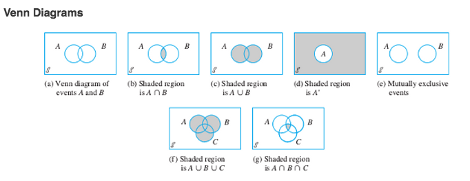
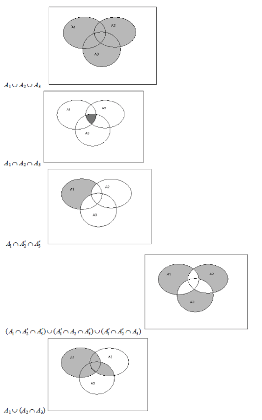

## Definitions 

> The term **probability** refers to the study of randomness and uncertainty. 

> An **experiment** is any activity or process whose outcome is subject to uncertainty. 

> The **sample space** of an experiment, denoted by $\mathscr{S}$, is the set of all possible outcomes of that experiment. 

> An **event** is any collection (subset) of outcomes contained in the sample space $\mathscr{S}$. An event is **simple** if it consists of exactly one outcome and **compound** if it consists of more than one outcome. 

> 1. The **complement** of an event A, denoted by $A'$, is the set of all outcomes in $\mathscr{S}$ that are not contained in A. 
> 2. The **union** of two events A and B, dentoed by $A\cup B$ and read "A or B", is the event consisting of all outcomes that are either in A or in B or in both events (so that the union includes outcomes for which both A and B occur as well as outcomes for which exactly one occurs) - that is, all outcomes in at least one of the events. 
> 3. The **intersection** of two events A and B, denoted by $A\cap B$ and read "A and B", is the event consisting of all outcomes that are in *both* A and B. 

> Let $\emptyset$ denote the *null event* (the event consisting of no outcomes whatsoever). When $A\cap B=\emptyset$, A and B are said to be **mutually exclusive** or **disjoing** events. 

> 

>

# More Content Coming Soon 
