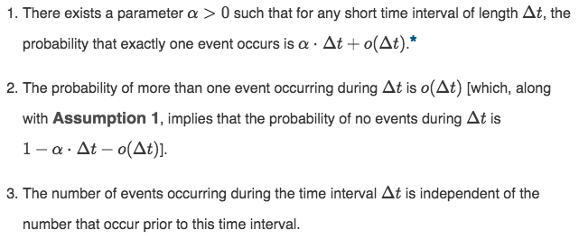
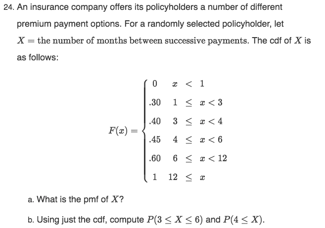
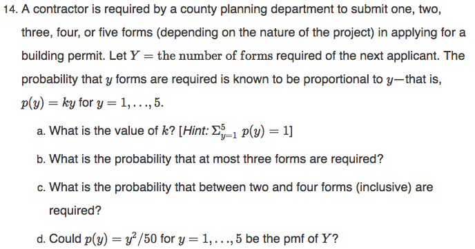

```{r, echo=F, message=F}
library(dplyr)
library(kableExtra) # highlights table when hover over a line
```

## Definitions

> For a given sample space $\mathscr{S}$ of some experiment, a **random variable (rv)** is any rule that associates a number with each outcome in $\mathscr{S}$. In mathematical language, a random variable is a funciton whose domain is the sample space and whose range is the set of real numbers. 

* Random variables are denoted by uppercase letters such as $X$ and $Y$. 

> Any random variable whose only possible values are 0 and 1 is called a **Bernoulli random variable** . 

> A **discrete** random variable is an rv whose possible values either consitiute a finite set or else can be listed in an infinite sequence in which there is a first element, a second element, and so on ("countable" infinite).

> A random variable is **continuous** if *both* of the following apply:
1. Its set of possible values consists either of all numbers in a single interval on the number line ($-\infty$ to $\infty$) or all number in a disjoint union of such intervals ($[0,10] \cap [20, 30]$). 

> The **Probability distribution** or **probability mass function** (pmf) of a discrete rv is defined for every number $x$ by $p(x)=P(X=x)=P($all $\omega \in \mathscr{S}:X(\omega)=x)$.

> Suppose $p(x)$ depends on a quantity that can be assigned any one of a number of possible values, with each different value determining a different probability distribution. Such a quantity is called a **parameter** of the distribution. The collection of all probability distributions for different value of the parameter is called a **family** of probability distributions. 

* Sometimes expressed $p(x;\alpha)$, where $\alpha$ is the parameter

* The Bernoulli family of distributions is between 0 and 1. 

> The **cumulative distribution** (cdf) $F(x)$ of a discrete random variable $X$ with pmf p(x) is defined for every number x by $$F(x)=P(X \leq x)=\sum_{y:y \leq x}^{} p(y)$$ For any number $x$, $F(x)$ is the probability that the observed value of $X$ will be at most x. 

> Let $X$ be a discrete random variable of possible values D and pmf $p(x)$. The **expected value** or **mean value** of $X$ denoted by $E(X)$ of $\mu x$ or just $\mu$, is $$E(X)=\mu x = \sum_{x \in D}^{} x\cdot p(x)$$

> Let $X$ have pmf p(x) and expected value $\mu$. Then the **variance** of $X$, denoted by $V(X)$ or $\sigma_{X}^2$ or just $\sigma ^2$, is $$V(X)=\sum_{D}^{} (x-\mu)^2 \cdot p(x)=E(X-\mu)^2]$$ The **standard deviation** (SD) of X is $$\sigma x \sqrt{ \sigma_{X}^2}$$ 

> An experiment for which **Condition 1**, **Condition 2**, **Condition 3**, **Condition 4** (a fixed number of dichotomous, independent, homogenous trials) are satisfied is called a **binomial experiment**.  

> The **binomial random variable X** associated with a binomial experiment consisting of $n$ trials is defined as $X =$ the number of S's among the n trials.

* because the pmf of a binomial random variable X depends on the two parameters $n$ and $p$, we denote the pmf by $b(x;n,p)$

> The random variable of interest is X = the number of failures that preced the rth success; X is called a **negative binomial random variable** because, in contrast to the binomial rv, the number of successes is fixed and the number of trials is random. 

> Both X = number of F's and Y = number of tirals $(=1+X)$ are referred to in the literature as **geometric random variables**, with its corresponding pmf called the **geometric distributions**

* $Y = X - Y

> A discrete random variable X is said to have a **Poisson distribution** with parameter $\mu (\mu >0)$ if the pmf of X is $$P(x;\mu )=\frac{e^{-\mu}\cdot \mu ^{x}}{x!}$$ $x=0,1,2,3,....$

## Theorems

> **Proposition - Computing Probabilities :** For any two numbers $a$ and $b$ with $a \leq b$, $$ P(a \leq X \leq b)=F(b)-F(a-)$$ where "$a-$" represents the largest possible X value that is strickly less than $a$. In particular, if the only possible values are integers and $a$ and $b$ are integers, then $$P(a \leq X \leq b)=P(X=a or a+1 or ..... or b) = F(b)-F(a-1)$$ Taking $a=b$ yields $P(X=a)=F(a)-F(a-1)$ in this case. 

* mainly used for binomial and Poisson probabilities

> **Proposition - Expected Value of a Function : **If the random variable $X$ has a set of possible values D and pmf $p(x)$, then the expected value of any function $h(X)$, denothed by $E[h(X)]$ or $\mu_{h(x)}$ is computed by $$E[h(X)]=\sum_{D}^{} h(x) \cdot p(x)$$


> **Proposition - Expected Value of a Linear Function : **$$E(aX+b)=a\cdot E(X)+b$$ (Or, using alternative notation, $\mu_aX+b = a\cdot \mu x +b$). To paraphrase, the expected value of a linear function equals the linear function evaluated at the expected value $E(X)$. 

Two important rules of expected values :

1. For any constant $a,E(aX)=a\cdot E(x)$ (take $b=0$).

2. For any constant $b,E(bx)=E(X)+b$ (take $a = 1$).

> **Proposition - Shortcut for $\sigma^2$ : ** $$V(X)=\sigma^2=[\sum_{D} x^2\cdot p(x)]-\mu^2=E(X^2)-[E(X)]^2$$

> **Proposition - Variance of a Linear Function : **$$V(aX)+b=\sigma_{aX+b}^2 = a^2 \cdot \sigma_{X}^{2}$$ and $$\sigma_{aX+b} = |a| \cdot \sigma_X$$ In particular, $$\sigma_{aX} = |a| \cdot \sigma X, \sigma_{X+b}=\sigma X$$

> **Rule - binomial "without-replacement" : **Consider sampling without replacement from a dichotomous population of size N. if the sample size (number of trials) $n$ is at most 5% of the population size, the experiment can be analyzed as though it were a binomial experiment. 

* dichotomous : divided into two branches 

> **Theorem - Binomial Probability :**\usepackage{amsmath}
\[ 
b(x;n,p) = \begin{cases}
      (\frac{n}{p})p^x(1-p)^{n-x} & x =0,1,2,...n \\
      0 &\text{otherwise}\
   \end{cases}
\]
In otherwords: 
\[ 
b(x;n,p) = \begin{cases}
      \text{number of sequences of} \\
      \text{length n consisting of x S's}\
   \end{cases} \cdot \begin{cases}
      \text{probability of any} \\
      \text{particular such sequence}\
   \end{cases}
\]

> **Proposition - The Mean and Variance of X :**If $X$~Bin$(n,p)$, then $E(X)=np$, $V(X)=np(1-p)=npq$, and $\sigma x=\sqrt{npq}$ (where $q=1-p$)

> **Proposition - Hypergeometric distribution : **If $X$ is the number of S's (successes) in a completely random sample of size $n$ drawn from a population consisting of M S's and $(N-M)$F's (failures), then the probability distribution of $X$, called the **hypergeometric distribution**, is given: $$P(X=x)=h(x;n,M,N)=\frac{{M\choose x}{N-M\choose n-x}}{{N\choose n}}$$ for x an integer satisfying max$(o,n-N+M)\leq x\leq min(n,M)$.

> **Proposition - Mean and Variance of Hypergeometric Distribution : **The mean and variance of the hypergeometric rv $X$ having pmf $h(x;n,M,N)$ are $$E(x)=n\cdot\frac{M}{N}$$  $$V(X)=(\frac{N-n}{N-1})\cdot n\cdot \frac{M}{N}\cdot (1-\frac{M}{N})$$

> **Proposition - pmf of the negative binomial: **The pmf of the negative binomial rv X with parameters r = number of S's and $p=P(S)$ is $$nb(x;r,p)={x+r-1\choose r-1}p^{r}(1-p)^{x}$$ x = 1,2, ...

> **Proposition - Expected Value and Variance of a Negative Binomial :** If X is a negative binomial rv with pmf $nb(x;r,p)$, then $$E(X)=\frac{r(1-p)}{p}$$ $$ V(X)=\frac{r(1-P)}{p^{2}}$$

> **Proposition - The Poisson Disribution as a Limit :** Suppose that in  the binomial pmf $b(x;n,p)$, we let $n\rightarrow \infty$ and $p\rightarrow 0$ in such a way that $np$ approaches a value $\mu > 0$ . Then $b(x;n,p)\rightarrow p(x;\mu)$

> **Proposition - The Mean and Variance of X for Poisson Distribution :** If X has a poisson distribution with parameter $\mu$ , then $E(X)=V(X)=\mu$ .

> **Assumptions - The Poisson Process :** 
> 

> **Proposition - Poisson Process Expected Number :** $P_{k}(t)=e^{-\alpha t}\cdot \frac{(\alpha t)^{k}}{k!}$ , so that the number of events during a time interval of length t is a Poisson rv with parameter $\mu = \alpha t$ . The expected number of events during any such time interval is then $\alpha t$ , so the expected number during a unit interval of time is $\alpha$ .

# Examples

### In Class Example 1 : (7-8-2021)
\[ 
p(x) = \begin{cases}
      {4\choose 4}p^x (1-p)^{4-x} & x =0,1,2,3, 4 \\
      0 &\text{otherwise}\
   \end{cases}
\]
```{r, echo=F}
x <- c(0:4)
p.x <- c("1/16", "4/16", "6/16", "4/16", "1/16")
df <- data.frame("x" = x, "p.x" = p.x)
df_new <- as.data.frame(t(df))
options(scipen = 50) # get rid of e's
rownames(df_new) <- c("x", "p(x)")
kable(df_new, col.names = NULL, align = "cccccc") %>%
  kable_paper()%>%
  kable_material(c( "hover")) %>%
  column_spec(1, bold = T, border_right = T) 
```

Suppose $p=\frac{1}{4} = 0.25$

$p(0)={4\choose 0}(0.25)^{0}(0.75)^{4}=0.316$

$p(0)={4\choose 1}(0.25)^{1}(0.75)^{3}=0.420$

$p(0)={4\choose 2}(0.25)^{2}(0.75)^{2}=0.211$

$p(0)={4\choose 3}(0.25)^{3}(0.75)^{1}=0.047$

$p(0)={4\choose 4}(0.25)^{4}=0.004$

### In Class Example 2 : (7-8-2021)
***A shipment of 7 TV sets contains 2 defective TV's. A random sample of 3 TV's is tested. Let X = the number of defective TV's in the sample. x is a discrete r.v.** 
```{r, echo=F}
x <- c(0:2)
p.x <- c("2/7", "4/7", "1/7")
df <- data.frame("x" = x, "p.x" = p.x)
df_new <- as.data.frame(t(df))
options(scipen = 50) # get rid of e's
rownames(df_new) <- c("x", "p(x)")
kable(df_new, col.names = NULL, align = "cccccc") %>%
  kable_paper()%>%
  kable_material(c( "hover")) %>%
  column_spec(1, bold = T, border_right = T) 
```

$p(0)=P[X=0]=\frac{{5\choose 3}}{{7\choose 3}}=\frac{2}{7}$

$p(0)=P[X=1]=\frac{{2\choose 1}{5\choose 3}}{{7\choose 3}}=\frac{4}{7}$

$p(0)=P[X=2]=\frac{{2\choose 2}{5\choose 2}}{{7\choose 3}}=\frac{1}{7}$

$p(0)=P[X=x]=\frac{{2\choose x}{5\choose 3-x}}{{7\choose 3}}, x = 0 , 1, 2$

### Exercise 24 (page 108)


```{r, echo=F}
x <- c("1", "3", "4", "6", "12")
p.x <- c("0.30", "0.10", "0.05", "0.15", "0.40")
df <- data.frame("x" = x, "p.x" = p.x)
df_new <- as.data.frame(t(df))
options(scipen = 50) # get rid of e's
rownames(df_new) <- c("x", "p(x)")
kable(df_new, col.names = NULL, align = "cccccc") %>%
  kable_paper()%>%
  kable_material(c( "hover")) %>%
  column_spec(1, bold = T, border_right = T) 
```

b. $P[x\leq x\leq 6]=P[x\leq 6]-P[x<3]$=F(6)-F(3-)=0.60 - 0.30 = 0.30

### Exercise 13 (page 108)
Two fair six-sided dice are tossed independetly. Let M = the maximum of the two tosses (so M(1,5) = 5, M(3,3) = 3, ect.)

a. **What is the pmf of M? [Hint: First determine $p(1)$, then $p(2)$, and so on.]**

p(1)=p[M=1]=p(1,1)=p[1 with the frist die] x p[1 with the second die] = $\frac{1}{6} \cdot \frac{1}{6}=\frac{1}{36}$

p(2)=p[M=2]=p((1,2), (2,1), (2,2))=$\frac{1}{36}+ \frac{1}{36}+ \frac{1}{36} =\frac{3}{36}$

p(3)=p[M=3]=p((1,3), (2,3), (3,3), (3,1), (3,2))= $\frac{5}{36}

p(3)=p[M=3]=p((1,4), (2,4), (3,4), (4,4), (4,1), (4,2), (4,3))= $\frac{7}{36}

p(5)= $\frac{9}{36}$

p(6)= $\frac{11}{36}$

```{r, echo=F}
x <- c(1:6)
p.x <- c("1/36", "3/36", "5/36", "7/36", "9/36", "11/36")
df <- data.frame("x" = x, "p.x" = p.x)
df_new <- as.data.frame(t(df))
options(scipen = 50) # get rid of e's
rownames(df_new) <- c("M", "p(m)")
kable(df_new, col.names = NULL, align = "cccccc") %>%
  kable_paper()%>%
  kable_material(c( "hover")) %>%
  column_spec(1, bold = T, border_right = T) 
```

b. **Determine the cdf of M and graph it. ** 

### Exercise 13 (page 108)
A mail-order computer buisness has six telephone lines. Let X denote the numebrof lines in use at a specified time. Suppose the pmf of X is given in the accompanying table. 
```{r, echo=F}
x <- c(0:6)
p.x <- c("0.10", "0.15", "0.20", "0.25", "0.20", "0.06", "0.04")
df <- data.frame("x" = x, "p.x" = p.x)
df_new <- as.data.frame(t(df))
options(scipen = 50) # get rid of e's
rownames(df_new) <- c("x", "p(x)")
kable(df_new, col.names = NULL, align = "cccccc") %>%
  kable_paper()%>%
  kable_material(c( "hover")) %>%
  column_spec(1, bold = T, border_right = T) 
```
a. **at most three lines are in use**

P[$3\leq 3$]=p(0)+p(1)+p(2)+p(3)=0.1+0.15+0.2+0.25=0.7

b. **fewer than three lines are in use**

P[$x<3$]=0.45

c. **at least three lines are in use**

P[$x\geq 3$]=1-P[$x<3$]=0.55

d. **between two and five lines, inclusive, are in use**

P[$2<x\leq 5$]=p(2)+p(3)+p(4)+p(5)=0.71

e. **between two and four lines, inclusive, are not in use**

= 0.65

f. **at least four lines are not in use** 

0.45

### Exercise 14 (page 108)


$\sum{}^{5} k(y)$=1=k(1+2+3+4+5)=15k

$k=\frac{1}{15}$

### Exercise 36 (page 116)
Let $X$ be the damage incurred (in dollars) in a certain type of accident during a given year. Possible $X$ values are 0, 1000, 5000, 10000, with probabilities of 0.8, 0.1, 0.08, 0.02, respectively. A particular company offers a 500 dollars deductible policy. If the company wishes its expected profit to be 100 dollars, what premium amount should it charge?  

X = Damage incurred 

Y = h(x) = Amount the company pays = x - 500

```{r, echo = F}
x <- c(0, 1000, 5000, 10000)
p.x <- c(0.8, 0.1, 0.08, 0.02)
p.y <- c(0, 500, 4500, 9500)
damage.payout <- data.frame("x" = x, "p.x" = p.x, "p.y" = p.y)
damage.payout_new <- as.data.frame(t(damage.payout))
options(scipen = 50) # get rid of e's
kable(damage.payout_new, col.names = NULL) %>%
  kable_paper()
```

E[Y]=0(0.8) + 500(0.1) + 4500(0.08) + 9500(0.02) = 600 dollars

### Exercise 32 (page 16)
A certain brand of upright freezer is available in three different rated capacities: $16ft^3$, $18ft^3$, and $20ft^3$. Let $X=$ the rated capacity of a freezer of this brand sold at a certain store. Suppose that $X$ has pmf: 
```{r, echo=F}
x <- c(16,18,20)
p.x <- c(0.2,0.5,0.3)
df <- data.frame("x" = x, "p.x" = p.x)
df.new <- as.data.frame(t(df))
options(scipen = 50)
kable(df.new, col.names = NULL) %>%
  kable_paper()
```
a. **Compute $E(X)$, $E(X^2)$, and $V(X)$.**

E[x] = 16(0.2) + 18(0.5) + 20(0.3) = 3.2 + 9 + 6 = 18.2

E[$x^2$] = $16^2$(0.2) + $18^2$(0.5) + $20^2$(0.3) = 333.2

$\sigma ^2$ = Var(x) = E[$x^2$]-$[E[x]]^2$ = 333.2 - $18.2)^2$ = 1.96

$\sigma$= 1.4

b. **If the price of a freezer having capacity of $X$ is $70X-650$, what is the expected price paid by the next customer to buy a freezer?** 

c. **What is the variance of the price paid by the next custormer?** 

d. **Suppose that although the rated capacity of a freezer is $X$, the actual capacity is $h(X)=X-0.008X^2$. What is the expected actual capacity of the freezer purchased by the next customer?** 

---

### In Class Example (7-15-2021)
Suppose that the probability of giving birth to a femal is $\frac{1}{2}$. A family decides to have children until they have a son. What is the probability of giving birth to 3 females before a son is born? 

$x$ = Number of females until a son is born

$x$~Geometric distribution with $1=\frac{1}{2}$

$P[x=3]=( \frac{1}{2})^2( \frac{1}{2})=\frac{1}{16}$

### Exercise 80 (page 135)
Let $X$ be the number of material anomalies occuring in a particulat region of an aircraft gas-turbine disk. The article **"Methodology for Probabilistic Life Prediction of Multiple-Anomaly Materials" (Amer. Inst. of Aeronautics and Astronautics J., 2006: 787-793)** proposes a Poisson distribution for X. Suppose that $\mu =4$. 

a. **Compute both $P(X\leq4)$ and $P(X<4)$.**

Using a TI-83 : [2nd] $\rightarrow$ [DISTR] $\rightarrow$  [C:poissoncdf(4,4)]

$P(X\leq4) = 0.6288$

Using a TI-83 : [2nd] $\rightarrow$ [DISTR] $\rightarrow$  [C:poissoncdf(4,3)]

$P(X<4)=P(X\leq 3) = 0.4335$

Note: $P(X=4) = 0.629-0.433 = 0.196$

b. **Compute $P(4\leq X \leq 8)$.**

$P(4\leq X \leq 8)= 0.979 - 0.4335 = 0.5455$

c. **Computer $P(8\leq X)$.**

Using a TI-83 : [2nd] $\rightarrow$ [DISTR] $\rightarrow$  [C:poissoncdf(4,8)]

$P(8\leq X) = 0.979$

d. **What is the probability that the numebr of anomalies exceeds its mean value by no more than one standard deviation?** 

$P[X>\mu + \sigma]=P[X>4+2]=P[x>6]=1-F(5)=0.21486$

### Exercise 87 (page 136)
The number of requests for assitance received by a towing service is a Poisson process with rate $\alpha =4$ per hour. 

a. **Compute the probability that exactly ten requests are received during a particular 2-hour period.** 

Using a TI-83 : [2nd] $\rightarrow$ [DISTR] $\rightarrow$  [C:poissonpdf(8,10)]

$P(X=10)=0.09926$

b. **If the operators of the towing service take a 30-min break for lunch, what is the probability that they do not miss any calls for assistance?** 

Define Y as the number of requests during a 30 minute period.

$y$~$P(\mu =\frac{4}{2}=2)$

Using a TI-83 : [2nd] $\rightarrow$ [DISTR] $\rightarrow$  [C:poissonpdf(2,0)]

$P(Y=0)=0.13533$

c. **How many calls would you expect during their break?** 

$E(Y)=2$

### Exercise 50 (page 124)
A particular telephone number is used to receive both voice calls and fax messages. Suppose that 25% of the incoming calls involve fax messages, and consider a sample of 25 incoming calls. What is the probability that

a. **At most 6 calls involve a fax message?**

[binomialcdf(25,.25,6)]=0.561

b. **Exactly 6 of the calls involve a fax message?**

$P[x=6]$ = $25\choose6$ $(0.25)^6(0.75)^{19}$

[binomialpdf(25,.25,6)]=0.1828

c. **At least 6 of the calls involve a fax message?**

[binomialpdf(25,.25,5)]=0.1828

$P(x\geq 6)=1-P[x<6]=1-P[x\leq 5]=0.6217$

d. **More than 6 of the calls involve a fax message?**

$P[x\geq 6]=1-0.5610=0.439$

# Homework

### Homework 4
1. **3.12 : Airlines sometimes overbook flights. Suppose that for a plane with 50 seats, 55 passengers have tickers. Define the random variable Y as the number of ticketed passengers who actually show up for the flight. The probability mass function of Y appears in the accompanying table.** 
```{r, echo=F}
y <- c(45, 46, 47, 48, 49, 50, 51, 52, 53, 54, 55)
p.y <- c(0.05, 0.10, 0.12, 0.14, 0.25, 0.17, 0.06, 0.05, 0.03, 0.02, 0.01)
df <- data.frame("y" = y, "p.y" = p.y)
df_new <- as.data.frame(t(df))
options(scipen = 50) # get rid of e's
rownames(df_new) <- c("y", "p(y)")
kable(df_new, col.names = NULL) %>%
  kable_paper() %>%
  kable_material(c( "hover"))
```
(a.) **What is the probability that the flight will accommodate all ticketed passengers who show up?**

P($y\leq50$)=(0.05+0.10+0.12+0.14+0.25+0.17)=0.83

(b.) **What is the probability that not all ticketed passengers who show up can be accommodated?**

P(y>50)=1-P($y\leq50$)=1-0.83=0.17

(c.) **If you are the first person on the standby list (which means you be the first one to get on the plane if there are any seats available after all ticketed passengers have been accommodated), what is the probability that you will be able to take the flight? What is this probability if you are the third person on the standby list?**

P(y<50)=(0.05+0.10+0.12+0.14+0.25)=0.66
P(y<48)=(0.05+0.10+0.12)=0.27

2. **3.22 : Refer to Exercise 13, and calculate and graph the cdf F(x). Then use it to calculate the probabilities of the events given in part (a), part (b), part (c), part (d) of that problem. **

**13. A mail-order computer business has six telephone lines. Let X denote the number of lines in use at a specified time. Suppose the pmf of X is as given in the accompanying table. **
```{r, echo=F}
x <- c(0:6)
p.x <- c(0.10, 0.15, 0.20, 0.25, 0.20, 0.06, 0.04)
df <- data.frame("x" = x, "p.x" = p.x)
df_new <- as.data.frame(t(df))
options(scipen = 50) # get rid of e's
rownames(df_new) <- c("x", "p(x)")
kable(df_new, col.names = NULL) %>%
  kable_paper() %>%
  kable_material(c( "hover"))
```
\usepackage{amsmath}
\[ 
F_x(x) = \begin{cases}
      0 & x < 0 \\
      0.10 & 0 \leq x < 1 \\
      0.25 & 1 \leq x < 2 \\
      0.45 & 2 \leq x < 3 \\
      0.70 & 3 \leq x < 4 \\
      0.90 & 4 \leq x < 5 \\
      0.96 & 5 \leq x < 6 \\
      1 & 6 \leq x 
   \end{cases}
\]
```{r, echo=F}
x <- c(0,0,1,2,3,4, 5, 6)
y <- c(0,0.1,.25,.45,.7,.9,.96,1)
lines <- data.frame("x" = x, "y" = y)
plot(lines, main = "cdf of F(x)",
     ylab = "Cummulative Distribution",
     xlab = "Lines in Use (at one time)")
```

(a.) **{at most three lines are in use}**

P(X$\leq$ 3)=0.70

(b.) **{fewer than three lines are in use}**

P(X<3)=0.45

(c.) **{at least three lines are in use}**

P(X$\geq$ 3)=1-P(X<3)=0.55

(d.) **{between two and five lines, inclusive, are in use}**

P(2$\leq$ X$\leq$ 5)=0.96-0.25=0.71

2. **3.24 : An insurance company offers its policyholders a number of different premium payment options. For a randomly selected policyholder, let X = the number of months between successive payments. The cdf of X is as follows: **

\[ 
F(x) = \begin{cases}
      0 & x < 1 \\
      0.30 & 1 \leq x < 3 \\
      0.40 & 3 \leq x < 4 \\
      0.45 & 4 \leq x < 6 \\
      0.60 & 6 \leq x < 12 \\
      1 & 12 \leq x 
   \end{cases}
\]

(a.) **What is the pmf of X?**

\[ 
p(x) = \begin{cases}
      0 & X \ne {1, 3, 4, 6, 12 }\\
      0.3 & X =  1\\
      0.1 & X =  3\\
      0.05 & X =  4\\
      0.15 & X = 6 \\
      0.40 & X =  12\\
   \end{cases}
\]

(b.) **Using just the cdf, compute P($3\leq X\leq 6$) and P($4\leq X$).**

P($3\leq X\leq 6$)=0.60-0.30=0.30
P($4\leq X$)=0.45

4. **3.30 : An individual who has automobile insurance from a certain company is randomly selected. Let Y be the number of moving violations for which the individual was cited during the last 3 years. The pmf of Y is** 
```{r, echo=F}
y <- c(0, 1, 2, 3)
p.y <- c(.6, .25, .1, .05)
df <- data.frame("y" = y, "p.y" = p.y)
df_new <- as.data.frame(t(df))
options(scipen = 50) # get rid of e's
rownames(df_new) <- c("y", "p(y)")
kable(df_new, col.names = NULL) %>%
  kable_paper() %>%
  kable_material(c( "hover"))
```

(a.) **Compute E(Y).**

E(Y)=$\sum_{all y}^{3} yp(x)$=$0\cdot 0.6+1\cdot 0.25+2\cdot 0.2+3\cdot 0.05$=0.6

(b.) **Suppose an individual with Y violations incurs a surcharge of 100$Y^2$ dollars. Calculate the expected amount of the surcharge.** 

E($100Y^2$)=100E($Y^2$)=100$\sum y^2p(y)$=100($0^2\cdot 0.6+1^2\cdot 0.25+2^2\cdot 0.2+3^2\cdot 0.05$)=100(1.1)=110

5. **3.35 : A small market orders copies of a certain magazine for its magazine rack each week. Let X = demand for the magazine, with pmf.**
```{r, echo=F}
x <- c(1:6)
p.x <- c("1/15", "2/15", "3/15", "4/15", "3/15", "2/15")
df <- data.frame("x" = x, "p.x" = p.x)
df_new <- as.data.frame(t(df))
options(scipen = 50) # get rid of e's
rownames(df_new) <- c("x", "p(x)")
kable(df_new, col.names = NULL) %>%
  kable_paper()%>%
  kable_material(c( "hover"))
```

**Suppose the store owner actually pays $2.00 for each copy of the magazine and the price to customers is $4.00. If magazines left at the end of the week have no salvage value, is it better to order three or four copies of the magazine? [Hint: For both three and four copies order, express net revenue as a function of demand X, and then compute the expected revenue.]**

Given the demand for the magazines is X, 
Let the profit be y, and define the number of magazines ordered to be n. Therefore, 
\[ 
y = \begin{cases}
      4x-2n & n > x \\
      2n & n \leq x \\
   \end{cases}
\]
```{r, echo=F}
x <- c(1:6)
y.3 <- c(-2, 2, 6, 6, 6, 6)
y.4 <- c(-4, 0, 4, 8, 8, 8)
df <- data.frame("x" = x, "y.3" = y.3, "y.4" = y.4)
df_new <- as.data.frame(t(df))
options(scipen = 50) # get rid of e's
rownames(df_new) <- c("x", "y when n = 3", "y when n = 4")
kable(df_new, col.names = NULL, row.names = ) %>%
  kable_paper() %>%
  kable_material(c( "hover"))
```

E[$y_3 (X)$]=$\sum_{i = 1}^{6} yp(x)$=(-2)($\frac{1}{15}$)+(2)($\frac{2}{15}$)+(6)($\frac{3}{15}$)+(6)($\frac{4}{15}$)+(6)($\frac{3}{15}$)+(6)($\frac{2}{15}$)=4.93

E[$y_4 (X)$]=$\sum_{i = 1}^{6} yp(x)$=(-4)($\frac{1}{15}$)+(0)($\frac{2}{15}$)+(4)($\frac{3}{15}$)+(8)($\frac{4}{15}$)+(8)($\frac{3}{15}$)+(8)($\frac{2}{15}$)=5.33

It is better to order 4 copies of magazines because the expected profit is greater than ordering 3 copies. 

6. **3.39 : A chemical supply company currently has in stock 100 lb of a certain chemical, which it sells to customers in 5lb batches. Let X = the number of batches ordered by a random chosen customer, and suppose that X has pmf.**
```{r, echo=F}
z <- c(1:4)
p.z <- c(.2, .4, .3, .1)
df <- data.frame("z" = z, "p.z" = p.z)
df_new <- as.data.frame(t(df))
options(scipen = 50) # get rid of e's
rownames(df_new) <- c("z", "p(z)")
kable(df_new, col.names = NULL) %>%
  kable_paper()%>%
  kable_material(c( "hover"))
```

**Compute E(X) and V(X). Then compute the expected number of pounds left after the next customer’s order is shipped and the variance of the number of pounds left. [Hint: The number of pounds left is a linear function of X.]**

E(X)=$\sum zp(z)$=(1)(0.2)+(2)(0.4)+(3)(0.3)+(4)(0.1)=2.3

E($X^2$)=$\sum z^2 p(z)$=(1)(0.2)+(4)(0.4)+(9)(0.3)+(16)(0.1)=6.1

V(X)=E($X^2$)-$[E(x)]^2$=6.1-$2.3^2$=0.81

Given X is the number of batches order,
Let y be the lb’s of a certain chemical currently in stock. 
Then, 

y = 100-5
```{r, echo=F}
z <- c(1:4)
y <- c(95, 90, 85, 80)
df <- data.frame("z" = z, "y" = y)
df_new <- as.data.frame(t(df))
options(scipen = 50) # get rid of e's
kable(df_new, col.names = NULL) %>%
  kable_paper()%>%
  kable_material(c( "hover"))
```

E(Y)=$\sum yp(z)$=(95)(0.2)+(90)(0.4)+(85)(0.3)+(80)(0.1)=88.5

E($Y^2$)=$\sum y^2 p(z)$=(9025)(0.2)+(8100)(0.4)+(7225)(0.3)+(6400)(0.1)=7852.5

V(Y) = E($Y^2$) - $[E(Y)]^2$ = 7852.5 - $88.5^2$ = 20.25

### Homework 5

1. **3.52 : Suppose that 30% of all students who have to buy a text for a partibular course want a new copy (the successes!), wheras the other 70% want a used copy. Consider randomly selecting 25 purchasers.**

(a.) **What are the mean value and standard deviation of the number who want a new copy of the book?**

(b.) **What is the probability that the number who want new copies is more than two standard deviations away from the mean value?** 

(c.) **The bookstore has 15 new copies and 15 used copies in stock. If 25 people come in one by one to purchase this text, what is the probability that 25 will get the type of book they want from current stock? [Hint: Let X = the number who want a new copy. For what values of X will all 25 get what they want?]**

(d.) **Suppose that new copies cost 100 dollars and used copies cost 70. Assume the bookstore currently has 50 new copies and 50 used copies. What is the expected value of total revenue from the sale of the next 25 copies purchsed? be sure to indicate what rule of expected value you are using. [Hint: Let h(X) = the revenue when X of the 25 purchasers want new copies. Express this as a linear function]** 

2. **3.60 : A toll bridge charges 1.00 dollar for passenger cars and 2.50 for the other vehicles. Suppose that during daytime hours, 60% of all vehicles are passenger cars. If 25 vehicles cross the bridge during a particular daytime period, what is the resulting expected toll revenue? [Hint: Let X = the number of passenger cars; then the toll revenue h(X) is a linear function of X.]**

Let X = the number of passenger cars.

Revenue = $1.00(X)+2.50(25-X)$

E(X)=np=25(.6)=15

Expected Revenue = 1.00(15)+2.50(25-15)=15.00+25.00=40.00

3. **3.70 : An instructor who taught two sections of engineering statistics last term, the first with 20 students and the second with 30, decided to assign a term project. After all projects had been turned in, the instructor randomly ordered them before grading. Consider the first 15 graded projects.** 

$$N=20+30=50 \quad n=15 \quad M =30$$

(a.) **What is the probability that exactly 10 of these are from the second section?** 

Using Calculator for hypergeometric distribution 

$P(X=10)=h(10;15,30,50)=0.206953879=20.7$ %

(b.) **What is the probability that at least 10 of these are from the second section?**

Using Calculator for hypergeometric distribution 

$P(X\geq 10)=0.379818805=37.98$ %

(c.) **What is the probability that at least 10 of these are from the same section?** 

Using Calculator for hypergeometric distribution  

$P_{M=20}(X\leq 10)=h(10;15,20,50)=0.013985119=1.4$ %

$P_{(M=20 and M=30)}(X\leq 10) =3 7.98 +1.4 = 39.38$ %

(d.) **What are the mean value and standard deviation of the number among these 15 that are from the second section?** 

$E(X)=n\cdot \frac{M}{N}=(15)(\frac{30}{50})=9$

$V(X)=\sqrt{(\frac{N-n}{N-1})\cdot n\cdot \frac{M}{N}\cdot (1-MN)}=\sqrt{(\frac{35}{49})(15)(\frac{3}{5})(\frac{2}{5})}=2.57=1.60$

(e.) **What are the mean value and standard deviation of the number of projects not among these first 15 that are from the second section?** 

$E(X)=n\cdot \frac{M}{N}=(15)(\frac{20}{50})=6$

$V(X)=\sqrt{(\frac{N-n}{N-1})\cdot n\cdot \frac{M}{N}\cdot (1-MN)}=\sqrt{(\frac{35}{49})(15)(\frac{2}{5})(\frac{3}{5})}=2.57=1.60$

4. **3.74 : A second-stage smog alert has been called in a certain area of Los Angeles County in which there are 50 industrial firms. An inspector will visit 10 randomly selected firms to check for violations of regulations.** $$N=50 \quad n=10$$

(a.) **If 15 of the firms are actually violating at least one regulation, what is the pmf of the number of firms visited by the inspector that are in violation of at least one regulation?** 

Using a hypergeometric distribution for a small population of 50 : 

$p(x)=P(X=x)=h(x;10,15,50)=\frac{{15\choose x}{35\choose{10-x}}}{{50}\choose{10}} for x=1,2,3,...,10$

(b.) **If there are 500 firms in the area, of which 150 are in violation, approximate the pmf of part(a) by a simpler pmf.**


(c.) **For X = the number among the 10 visited that are in violation, compute E(X) and V(X) both for the exact pmf and the approximating pmf in part (b).**  

5. **3.76 : A family decides to have children until it has three children of the same gender. Assuming P(B)=P(G)=0.5 what is the pmf of X = the number of children in the family?** 

6. **3.96 : The negative binomial rv X was defined as the number of F’s preceding the rth S. Let Y = the number of trials necessary to obtain the rth S. In the same manner in which the pmf of X was derived, derive the pmf of Y.**

7. **3.97 : Of all customers purchasing automatic garage-door openers, 75% purchase a chain-driven model. Let X = the number among the next 15 purchasers who select the chain-driven model.**

(a.) **What is the pmf of X?** 

(b.) **Compute $P(X>10)$.**

(c.) **Compute $P(6\leq X\leq 10)$.**

(d.) **Compute $\mu$ and $\sigma ^2$.**

(e.) **If the store currently has in stock 10 chain-driven models and 8 shaft-driven models, what is the probability that the requests of these 15 customers can all be met from existing stock?** 

8. **3.100 : A manufacturer of integrated circuit chips wishes to control the quality of its product by rejecting any batch in which the proportion of defective chips is too high. To this end, out of each batch (10,000 chips), 25 will be selected and tested. If at least 5 of these 25 are defective, the entire batch will be rejected.** 

(a.) **What is the probability that a batch will be rejected if 5% of the chips in the batch are in fact defective?** 

(b.) **Answer the question posed in (a) if the percentage of detective chips in the batch is 10%.** 

(c.) **Answer the question posed in (a) if the percentage of defective chips in the batch is 20%.** 

(d.) **What happens to the probabilities in (a), (b), (c) if the critical rejection number is increased from 5 to 6?** 

9. **3.110 : Grasshoppers are distributed at random in a large field according to a Poisson process with parameter $\alpha$ =2 per square yard. How large should the radius R of a circular sampling region be so that the probability of finding at least one in the region equals 0.99?**  

Bonus : **3.52 : Suppose E(X) = 5 and E(X(X-1)] =27.5. What is:** 

(a.) **E($X^2$)? [Hint: First verify that $E[X(X(-1)]=E(X^2)-E(X)]$?**

(b.) **V(X)?**

(c.) **The general relationship among the quantites E(X), E(X(X-1)), and V(X)?** 
