# Definitions

> Let $X$ be a continuous random variable. Then a **probability distribution** or **probability density function** (pdf) of $X$ is a funciton $f(x)$ such that any two numbers a and b with $a\leq b$, $$P(\alpha \leq X \leq b) = \int_{a}^{b} f(x) dx$$ That is, the probability that $X$ takes on a value in the interval $[a,b]$ is the area above this interval and under the graph of the density funciton, as illustrated in **Figure 4.2** . The graph of $f(x)$ is often referred to as the *density curve*.  
<center>
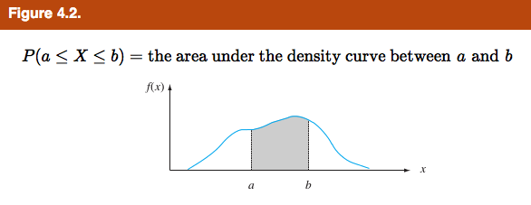
</center>

> A continuous random variable $X$ is said to have a **uniform distribution** on the interval $[A,B]$ if the pdf of $X$ is <center>
\[ 
f(x;A,B) = \begin{cases}
      \frac{1}{B-A} & A \leq x \leq B \\
      0 & \text{otherwise} 
   \end{cases}
\]
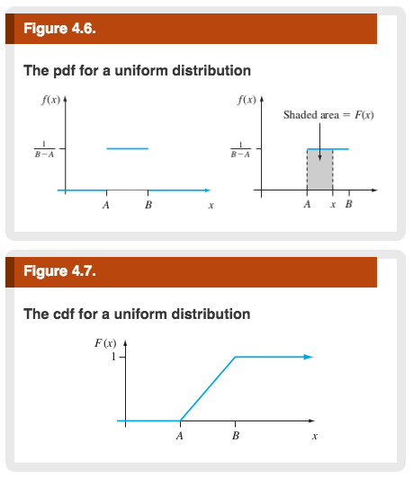
</center>

* continuous at all possible values of interval

* cdf of x is : 
\[ 
F(X) = \begin{cases}
      0 & if x\leq A \\
      \frac{x-A}{B-A} & if A\leq x\leq B\\ 
      1 & x \geq B
   \end{cases}
\]

* cdf is always a non-decreasing function 

> The **cumulative distribution function** $F(x)$ for a continuous random variable $X$ is defined for ever number $x$ by $$F(x) = P(X \leq x ) \ \int_{- \infty}^{x} f(y)dy $$ For each $x, F(x)$ is the area under the density curve to the left of x. This is illustrated in **Figure 4.5**, where $F(x)$ increases smoothly as x increases. 
<center>

</center>

> Let $p$ be a number between 0 and 1. The $(100p)$th **percentile** of the distribution of a continuous rv X, denoted by $\eta (p)$, is defined by $$p=F(\eta (p))=\int_{-\infty}^{\eta (p)}f(y)dy$$
<center>
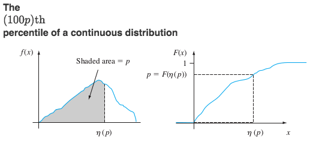
</center>

* For $\eta =\frac{1}{2}$ the median is $\eta (p)$

> The **median** of a continous distribution, denoterd by $\widetilde \mu$ , is the 50th percentile, so $\widetilde \mu$ satisifies $0.5=F(\widetilde \mu)$ . That is, half the area under the density curve is to the left of $\widetilde \mu$ and half is to the right of $\widetilde \mu$ . 

<center>
> 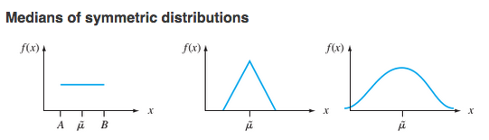
</center>

> The **expected** or **mean value** of a continuous rv X with pdf $f(x)$ is $$\mu x=E(x)=\int_{-\infty}^{\infty}x\cdot f(x)dx$$

> The **variance** of a continuous rv X with pdf $f(x)$ and mean value $\mu$ is $$\sigma_{X}^{2}=V(X)=\int_{-\infty}^{\infty}(x-\mu)^2\cdot f(x)dx=E[(X-\mu)^2]$$

> The **standard deviation** (SD) of X is $\sigma_{X}=\sqrt{V(X)}$

> A continuous rv X is said to have a **normal distribution** with parameters $\mu$ and $\sigma$ (or $\mu$ and $\sigma ^2$), where$-\infty < \mu < \infty$ and $0<\infty$, if the pdf of X is $$f(x;\mu ,\sigma )=\frac{1}{\sqrt{2\pi }\sigma }e^{\frac{-(x-\mu)^2}{{(2\sigma ^2)}}}\quad{-\infty <x<\infty}$$ 

* Gaussian Distribution , bell shape curve

* most popular distribution, and most distributions are related to this model

* $\mu$ : mean is the center (location) of the curve, and $\sigma$ is the variability 

> The normal distribution with parameter values $\mu = 0$ and $\sigma =1$ is called the **standard normal distribution**. A rv having a standard normal distribution is called a **standard normal random variable** and will be denoted by $Z$. the pdf of $Z$ is $$f(x;0,1)=\frac{1}{\sqrt{2\pi }}e^{\frac{-z^2}{2}}\quad{-\infty <x<\infty}$$
> The graph of $f(z;0,1)$ is called the *standard normal* (or $\mathscr{z}$) curve. Its inflections points are at 1 and -1. The cdf of Z is $P(Z\leq z)=\int_{-\infty}^{z}f(y;0,1)dy$ , which we will denote by $\Phi (\mathscr{z})$ .
<center>
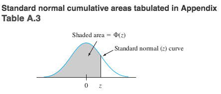
</center>

* When z goes to infinity the e^ goes to 0 very fast 

* z table goes from z-values of -3.4 to 3.4 

* E[Z]=0, and Var[Z]=1

* $E[x]=\mu$, and $Var(x)=\sigma ^2$

* For **any** normal distribution $z=\frac{x-\mu}{\sigma}\approx N(0,1)$

* \begin{equation} \label{psn}
\begin{split} 
P[a\leq x\leq b] & = P[(\frac{a-\mu}{\sigma})\leq (\frac{x-\mu}{\sigma})\leq (\frac{b-\mu}{\sigma})]\\
& = P[(\frac{a-\mu}{\sigma})\leq Z\leq (\frac{b-\mu}{\sigma})] \quad \text{where z ~ (0,1)}\\
& =\Phi (\frac{b-\mu}{\sigma}) - \Phi (\frac{a-\mu}{\sigma})
\end{split}
\end{equation}

* 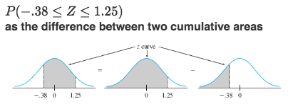

> A **continuity correction** is an adjustment that is made when a discrete distribution is approximated by a continuos distribution. 

* usually adding or subtracting 0.5 before standardizing 

* makes continuous (stretches out 3 between 2.5 and 3.5)

> $X$ is said to have an **exponential distribution** with (scale) parameter $\lambda (\lambda >0)$ if the pdf of $X$ is
\[ 
f(x;\lambda ) = \begin{cases}
      \lambda e^{-\lambda x} & x\geq 0 \\
      0 &\text{otherwise}\
   \end{cases}
\]
<center>
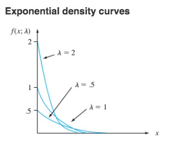
<\center>

* sometimes pdf is written as $(\frac{1}{\beta}e^{-x/\beta})$ , so that $\beta = \frac{1}{\lambda}$

* With cdf :
\[ 
F(x;\lambda ) = \begin{cases}
      0 & x< 0 \\
      1-e^{-\lambda x} &x\geq 0\
   \end{cases}
\]

* pdf given in class : 
\[ f(x) = \begin{cases}
      0 & x\leq 0 \\
      \frac{1}{\mu}e^{-x/\mu} & x\geq 0\
   \end{cases}\]

* cdf given in class $F(x)=1-e^{-x/\mu}$ if $x>0$

* $E(X)=\mu$

* $Var(X)=\sigma (x)=\mu$

* Exponential distributions are used to model lifetimes 


> For $\alpha >0$, the **gamma function** $\Gamma (\alpha)$ is defined by $$\Gamma (\alpha)=\int_{0}^{\infty} x^{\alpha -1}e^{-x}dx$$

* very important integral : $\int_{0}^{\infty} x^{\alpha}e^{-x/\beta}dx=\alpha \beta=\mu=E(x)$

The most important properties of the gamma function are thus: 

* For any $\alpha >1$, $\Gamma (\alpha) = (\alpha -1)\cdot \Gamma (\alpha -1)$ [via integration by parts]

* For any positive integer $n$, $\Gamma (n)=(n-1)!$

* $\Gamma (\frac{1}{2})=\sqrt{\pi}$

pdf of a Gamma function: 
\[ 
f(x;\alpha ) = \begin{cases}
      \frac{x^{\alpha-1}e^{-x}}{\Gamma (\alpha)} & x\geq 0 \\
      0 &\text{otherwise}\
   \end{cases}
\]

* $\Gamma (\alpha)=\int_{0}^{\infty} x^{\alpha -1}e^{-x}dx=(\alpha -1)\int_{0}^{\infty} x^{\alpha -2}e^{-x}dx$

* If $\alpha$ is an (enliga?) then $$\sqrt{(\alpha)}=(\alpha -1)!$$ $$\sqrt{(\frac{1}{2})}=\sqrt{(\pi)}$$

> A continuous random variable $X$ is said to have a **gamma distribution** if the pdf of X is 
\[ 
f(x;\alpha ,\beta) = \begin{cases}
      \frac{x^{\alpha-1}e^{\frac{-x}{\beta}}}{\beta ^{\alpha }\Gamma (\alpha)} & x\geq 0 \\
      0 &\text{otherwise}\
   \end{cases}
\]
> where the parameters $\alpha$ and $\beta$ satisfy $\alpha > 0$, $\beta >0$. The **standard gamma distribution** has $\beta =1$, so the pdf of a standard gamma rv is given **Fig.4.27**. 
<center>
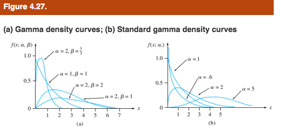
</center>

* typically skewed distribution 

* $\alpha$ is the shape parameter

* as alpha increases the graph become less and less skewed 

* flexible family of distribution

* $\beta$ is the scale parameter

* $E(X)=\mu =\alpha \beta$

* $V(X)=\sigma ^2=\alpha \beta ^2$

* need software to find gamma distribution

cdf of X for standard gamma rv 

* $F(x;\alpha )=\int_{0}^{x}\frac{y^{\alpha-1}e^{-y}}{\Gamma (\alpha)}dy \quad x>0$

Note that an **incomplete gamma function** doesn't have a $\Gamma (\alpha)$ in the integral

> Let $\nu$ be a positive integer. Then a random variable $X$ is said to have a **chi-squared distribution** with parameter $v$ if the pdf of $X$ is that gamma denstiy with $\alpha = \frac{v}{2}$ and $\beta =2$. The pdf of a chi-squared rv is thus
\[ 
f(x;\nu) = \begin{cases}
      \frac{x^{(\nu /2)-1}e^{-x/2}}{2^{\nu /2}\Gamma (\frac{\nu}{2})} & x\geq 0 \\
      0 &x<0\
   \end{cases}
\]
The parametr $\nu$ is called the **number of degrees of freedom** (df) of $X$. The symbol $\chi ^2$ is oftern used in place of "chi-squared". 

* special case of gamma distribution 

* will be discussed a lot in 452

* $Z^2$ has a chi-squared distribution 

* sample variance $s^2=\frac{1}{n-1}\sum (x_i-\overline{x})^2$

> A random variable X is said to have a **Weilbull distribution** with shape parameter $\alpha$ and scale parameter $\beta (\alpha >0,\beta >0)$ if the pdf of $X$ is 
\[
f(x;\alpha ,\beta ) = \begin{cases}
      \frac{\alpha }{\beta ^\alpha }x^{\alpha -1}e^{-(x/\beta )^\alpha} & x\geq 0 \\
      0 & x < 0\
      \end{cases}
\]
<center>
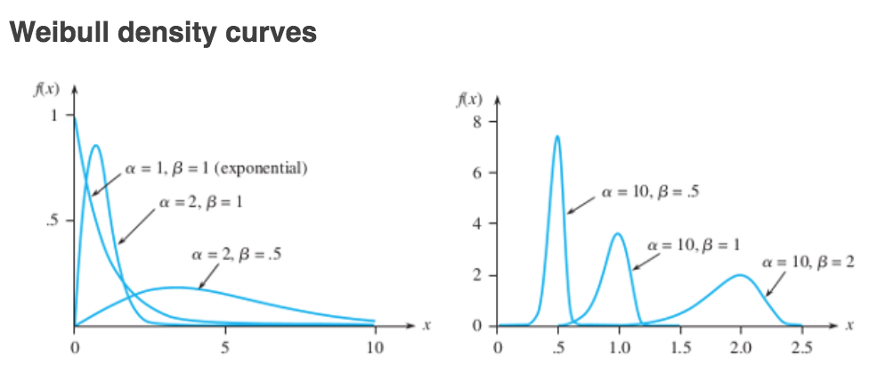
<\center>

* the cdf of the Weilbull rv having parameters $\alpha$ and $\beta$ is 
\[
F(x;\alpha ,\beta ) = \begin{cases}
         0 & x<0\\
         1-e^{-(x/\beta )^\alpha} & x\geq 0\
         \end{cases}
\]

> A nonegative rv $X$ is said to have **lognormal distribution** if the rv $Y=ln(X)$ has a normal distribution. The resulting pdf of a lognormal rv when $ln(X)$ is normally distributed with parameters $\mu$ and $\sigma$ is 
\[
f(x;\mu ,\sigma ) = \begin{cases}
         \frac{1}{\sqrt{2\pi}\sigma x}e^{-[ln(x)-\mu]^{2}/(2\sigma ^2)} & x\geq0\\
         0 & x<0\
         \end{cases}
\]
<center>
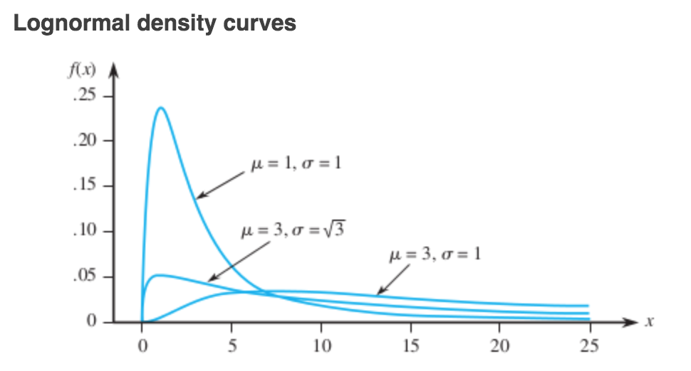
<\center>

* Because $ln(X)$ has a normal distribution, the cdf of $X$ can be expressed in terms of the cdf $\phi (z)$ of a standard normal rv $Z$. \begin{equation} \label{eqlog}
\begin{split}
F(x;\mu \sigma) & = P(X\leq x)=P[ln(X)\leq (x)]\\
& = P(Z\leq \frac{ln(x)-\mu }{\sigma})=\Phi (\frac{ln(x)-\mu }{\sigma}) \quad x\geq 0
\end{split}
\end{equation}

* be careful!! $\sigma$ and $\mu$ are not the mean and standard deviation of $X$ but of $ln(X)$

* $E(X)=e^{\mu +\sigma ^2 /2}$

* $V(X)=e^{2\mu +\sigma ^2}\cdot (e^{\sigma ^2}-1)$

> A random variable $X$ is said to have a **beta distribution** with parameters $\alpha$, $\beta$ (both postive), $A$, and $B$ if the pdf of $X$ is 
\[
f(x;\alpha ,\beta ,A, B) = \begin{cases}
         \frac{1}{B-A}\cdot\frac{\Gamma (\alpha +\beta )}{\Gamma (\alpha )\cdot \Gamma (\beta )}(\frac{x-A}{B-A})^{\alpha -1}(\frac{B-x}{B-A})^{\beta -1} & A \leq x\leq B\\
         0 & \text{otherwise}\
         \end{cases}
\]
> The case $A=0$ , $B=1$ give the **standard beta distribution** .
<center>
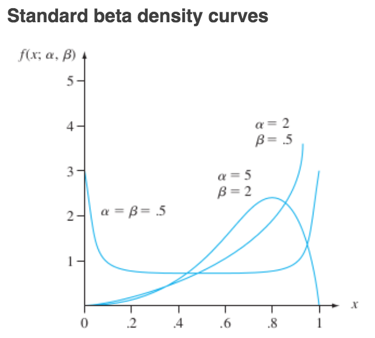
<\center>

* \[f(x) = \begin{cases}
         \frac{x^{\alpha -1}(1-x)^{\beta -1}}{B(\alpha \beta)} & x\in (0,1)\\
         0 & \text{otherwise}\
         \end{cases}\]
         
* beta distribution tells you about your thoughts and ideas

* $E[x]=\frac{\alpha}{\alpha +\beta}$

* If $\alph =\beta$ then $E[x]=\frac{1}{2}$

* $V[x]=\frac{\alpha \beta}{(\alpha +\beta )^2(\alpha +\beta +1)}$

> A **probability plot** is used for assessing whether or not a data set follows a given distribution (such as normal or Weibull). 

> Order the $n$ sample observations from the smallest to largest. Then the $ith$ smallest observation in the list is taken to be the $[100(i-0.5)/n]$ th **sample percentile** 

> A plot of the $n$ pairs $$[(100(i-0.5)/n]\text{th z percentile, ith smallest observation})$$ is called a **normal probability plot**. If the sample observations are in fact drawn from a normal distribution with mean value $\mu$ and standard deviation $\sigma$, the points should fall close to a straight line with slope $\sigma$ and intercept $\mu$ . Thus a plot for which the points call close to some straight line suggests that the assumption of a normal population distribution is plausible. 

* A non normal population distribution can oftern be placed in one of the following three categories: 

1. It is symmetric and has "lighter tails" than does a normal distribution; that is the density curve declines more rapidly out in the tails than does a normal curve. (uniform distribution)

2. It is symmetric and heavy-tailed compared to a normal distribution. (S-shaped plot, with left endpoint downward : observed < z percentile )

3. It is skewed. 

* $\theta _{1}=\mu \quad \theta _{2}=\sigma$  are location and scale parameters respectively. 

# Theorems

> **Proposition** : Let $X$ be a continuous random variable with pdf $f(x)$ and cdf $F(x)$. Then for any number $a$, $$P(X>a)=1-F(a)$$ and for any two numbers a and b with $a<b$, $$P(a \leq X \leq b) = F(b)-F(a)$$
<center>
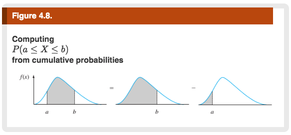
</center>

> **Proposition - Obtaining f(x) from F(x) :** IF X is a continuos rv with pdf $f(x)$ and cdf $F(x)$, then at every x at which the derivative $F'(x)$ exists, $F'(x)=f(x)$ .

* $f(x)=\frac{d}{dx}F(x)$ : find pdf by differentiating cdf

* $F(x)=\int_{-\infty}^{x}f(t)dt$ : find cdf by integrating pdf

* x is fixed point, do not use x within the function that being integrated (use dummy variable t)

> **Proposition :** If X is a continous rv with pdf $f(x)$ and $h(X)$ is any function of X, then $$E[h(X)]=\mu_{h}(x)=\int_{-\infty}^{\infty}h(x)\cdot f(x)dx$$

> **Proposition :** $$V(X)=E(X^2)-[E(X)]^2$$

* Special case is $U[0,1]$ where $E(X)=\frac{1}{2}$ , $Var(X)=\frac{1}{12}$

* $V(X)=\frac{(b-a)^2}{12}$

> **Proposition - Nonstandard Normal Distributions :** If $X$ has a normal distribution with mean $\mu$ and standard deviation $\sigma$, then $$Z=\frac{X-\mu}{\sigma}$$ has a standard normal distribution. Thus 
\begin{equation} \label{eqa}
\begin{split}
P(a\leq X\leq b) & =P(\frac{a-\mu}{\sigma}\leq Z\leq \frac{b-\mu}{\sigma})\\
& =\Phi (\frac{b-\mu}{\sigma})-\Phi (\frac{a-\mu}{\sigma})
\end{split}
\end{equation}
$P(X\leq a) = \Phi (\frac{a-\mu}{\sigma}) \quad \quad P(X\geq b)=1-\Phi(\frac{a-\mu}{\sigma})$

<center>
* 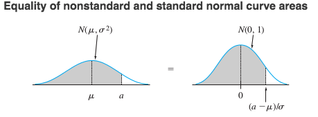
</center>

* If the population distribution of a variable is (approximately) normal, then : 

1. Roughly 68% oft he values are within 1 SD of the mean.
2. Roughly 95% oft he values are within 2 SD of the mean.
3. Roughly 99.7% oft he values are within 3 SD of the mean.

> **Proposition - Percentiles of an Arbitrary Normal Distribution :** $$(100p)\text{th percentile for normal} (\mu , \sigma ) = \mu +[(100p)\text{th for stadard normal}]\cdot \sigma$$

> **Proposition :** Let $X$ be a binomial rv based on $n$ trials with sccess probability $p$. Then if the binomial probability histogram is not too skewed, $X$ has approximately a normal distribution with $\mu=n p$ and $\sigma =\sqrt{npq}$. In particular, for $x=\text{a possible value of X}$,$$P(X\leq x)=B(x,n , p)\approx {\text{are under the normal curve}\choose{\text{to the left of}\quad x+0.5}}=\Phi(\frac{z+0.5-np}{\sqrt{npq}})$$ In practice, the approximation is adequate provided that both $np\geq10$ and $nq\geq10$ (i.e. the expected number of successes and the expected number of failures are both at least 10), since there is then enough symmetry in the underlying binomial distribution. 

What is large?

* If $p=\frac{1}{2}$ , $n\geq 10$

* If $p=0.1$ , $n\geq 50$

* If $p=0.9$ , $n\geq 50$

* larger the value of n, the better the approximation 

> **Proposition :** Suppose that the number of events occuring in any time interval of length t has a Poisson distribution with parameter $\alpha t$ (where $\alpha$ , the rate of the event process, is the expected number of events occuring in 1 unit of time) and that numbers of occurrences in nonoverlapping intervals are independednt of one another. Then the distribution of elapsed time between the occurrence of two successive events is exponential with parameter $\lambda =\alpha$

> **Proposition :** Let $X$ have a gamma distribution with parameters $\alpha$ and $\beta$. Then for any $x>0$, the cdf of $X$ is given by $$P(X\geq x)=F(x;\alpha, \beta)=F(\frac{x}{\beta};\alpha)$$ where $F(\cdot ;\alpha)$ is the incomplete gamma function.

# Examples

### Exercise 1 (page 146)
**The current in a certain circuit as measured by an ammeter is a continuous random variable X with the following density function:** 
\[ 
f(x) = \begin{cases}
      0.075x +0.2 & 3\leq x\leq 5 \\
      0 &\text{otherwise}\
   \end{cases}
\]

a. **Graph the pdf and verify that the total area under the density curve is indeed 1.** 
```{r, echo=F}
curve(0.075*x+0.2,3,5, ylim = c(0,0.75), ylab = "y")
```
\begin{equation} \label{eq1}
\begin{split}
\int_{-\infty}^{\infty}f(x)dx & =\int_{-\infty}^{3}0+\int_{3}^{5}(0.075x+0.2)dx+\int_{5}^{\infty}0\\
& =\frac{0.075x^2}{2}|_{3}^{3}+0.2(5-3)\\
& =\frac{(0.75)5^2}{2}-\frac{(0.75)3^2}{2}+0.4\\
& =1
\end{split}
\end{equation}

b. **Calculate $P(X\leq 4)$. How does this probability compare to P($X<4$)?**

\begin{equation} \label{eq2}
\begin{split}
P(X\leq 4) & =\int_{-\infty}^{4}f(x)dx\\
& =0+\int_{3}^{4}(0.70x+0.2)dx\\
& =\frac{0.075x^2}{2}+0.2|_{3}^{4}\\
& =0.4625
\end{split}
\end{equation}

$P(X\leq 4)=P(X<4)$

c. **Calculate $P(3.5\leq X\leq 4.5)$ and also P($4.5<X$).**

\begin{equation} \label{eq3}
\begin{split}
P(3.5\leq X\leq 4.5) & =\int_{3.5}^{4.5}f(x)dx\\
& =0.075\frac{x^2}{2}|_{3.5}^{4.5}+0.2\\
& =0.075(\frac{4.5^2}{2}-\frac{3.5^2}{2})+0.2\\
& =0.075(10.125-6.125)+0.2\\
& =0.5
\end{split}
\end{equation}

$P(X<4.5)=0.278125$
 
### Exercise 13 (page 155)
**Example 4.5** introduced the concept of time headway in traffic flow and proposed a particular distribution for X = the headway between two randomly selected consecutive cars (sec). Suppose that in a different traffic environment, the distribution of time headway has the form
\[ 
f(x) = \begin{cases}
      \frac{k}{x^4} & x>1\\
      0 & x\leq 1
   \end{cases}
\]
(a.) **Determine the value of $k$ for which $f(x)$ is a legitimate pdf.**
 
What is the value of k>0?
\begin{equation} \label{eq4}
\begin{split}
1 =\int_{-\infty}^{\infty}f(x)dx & =\int_{-\infty}^{1}f(x)dx+\int_{1}^{\infty}f(x)dx\\
& = 0+k\int_{1}^{\infty}\frac{1}{x^4}dx\\
& = k(\frac{x^{-3}}{-3})|_{1}^{\infty}\\
& = \frac{k}{3}
\end{split}
\end{equation}
$\Rightarrow k = 3$
 
(b.) **Obtain the cumulative distribuion function.** 

 $F(x)=0$ if $x\leq 1$ . So if $x>1$
 \begin{equation} \label{eq5}
\begin{split}
F(x) & =\int_{-\infty}^{x}f(t)dt \pm \int_{-\infty}^{1}f(t)dt + \int_{1}^{x}f(t)dt\\
& = 0 + \int_{1}^{x}\frac{3}{t^4}dt\\
& = 3(\frac{t^{-3}}{-3}|_{1}^{x})\\
& = 1 - \frac{1}{x^3}
\end{split}
\end{equation}
Therefore,
\[ 
F(x) = \begin{cases}
      0 & x\leq 1\\
      1 - \frac{1}{x^3} & x>1
   \end{cases}
\]
 
(c.) **Use the cdf from (b) to determine the probability that headway exceeds 2 sec and also the probability that headway is between 2 and 3 sec.** 
 
\begin{equation} \label{eq6}
\begin{split}
P[X>2] & =1-P[x\leq 2]\\
& = 1-F(2)\\
& = 1-(1-\frac{1}{2^3})\\
& = \frac{1}{8}
\end{split}
\end{equation}
\begin{equation} \label{eq7}
\begin{split}
P[2\leq x\leq 3] & =F(3)-F(2)\\
& = 1-\frac{1}{3^3}-(1-\frac{1}{2^3})\\
& = \frac{1}{8}-\frac{1}{27}\\
& = \frac{19}{216}
\end{split}
\end{equation}
 
(d.) **Obtain the mean value of headway and the standard deviation of headway** 

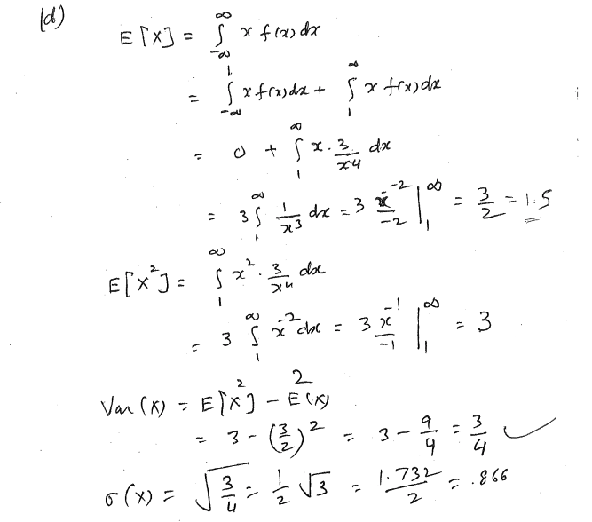 
 
(e.) **What is the probability that headway is within 1 standard deviation of the mean value?** 
 
\begin{equation} \label{eq9}
\begin{split}
P[\mu -\sigma \leq x \leq \mu +\sigma] & =P[1.5-0.866\leq x \leq 1.5+0.866]\\
& =P[0.34\leq x \leq 2.366]\\
& = F(2.366)-F(0.634)\\
& = 924
\end{split}
\end{equation}
 
### In Class Example (July 22nd 2021)
For exponential distribution with mean $\mu$, to find the median, solve the equations for $F(X)=\frac{1}{2}$


$$1-e^{-x/\mu}  =\frac{1}{2}$$
$$e^{-x/\mu}  =\frac{1}{2}$$
$$\frac{-x}{\mu}=ln(\frac{1}{2})$$
$$\Rightarrow M=-\mu ln(\frac{1}{2})=\mu ln(2)$$ 

* skewed to the right, drops exponentially fast to zero 

Suppose x is the lifetime, and s is when the item stops working (when x>s). What is the conditional probability that it will live longer than the expected value. $P[x>s+t|x>s]$

\begin{equation} \label{eq8}
\begin{split}
P[x>s+t|x>s] & =\frac{P[x>s+t]}{P[x>s]}\\
& = \frac{1-F(s+t)}{1-F(s)}\\
& = \frac{e^{-(s+t)}}{\mu}\\
& = e^{-t/\mu}
\end{split}
\end{equation}

* independent of s! called the memory-less property (forgets how long its been working)

### In Class Example (7-27-21) 
**Find area under the curve**

Using TI-83 : normalcdf(-1.960,1.960,0,1)

$P[\mu - 1.960\leq x\leq \mu + 1.960 ]=0.95$

Using TI-83 : normalcdf(-2.580,12.580,0,1)

$P[\mu - 2.580\leq x\leq \mu + 2.580 ]=0.99$

Using TI-83 : normalcdf(-1,1,0,1)

$P[\mu - \sigma \leq x\leq \mu +\sigma ]=0.68$

Using TI-83 : normalcdf(-1.6450,1.6450,0,1)

$P[\mu - 1.6450\leq x\leq \mu + 1.6450 ]=0.90$


### Exercise 13 (page 155)
**In a road-paving process, asphalt mix is delivered to the hopper of the pave by trucks that haul the material from the batching plant. The article ... proposed a normal distribution with mean value 8.46 min and standard deviation 0.913 min for rv with X = truck haul time.** 

(a.) **What is the probability that haul time will be at least 10 min? Will exceed 10 min?**

Using TI-83 : normalcdf(10,99999,8.46,0.913)

$P[x\geq 10]=0.0458$ 

(b.) **What is the probability that haul time will exceed 15 min?* 

Using TI-83 : normalcdf(15,99999,8.46,0.913)

$p[x\geq 15]\approx 0$

(c.) **What is the probability that haul time will be between 8 and 10 minutes?**

Using TI-83 : normalcdf(10,99999,8.46,0.913)

$P[8\leq x\leq 10]=0.647$

(d.) **What value $c$ is such that 98% of all haul times are in the interval from 8.46 -c to 8.46+c?**

<center>
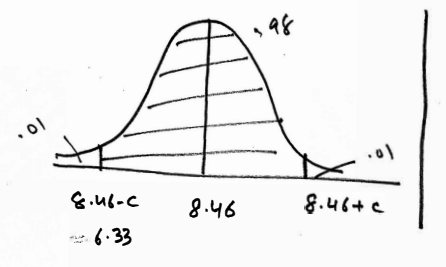
</center>

\begin{equation}\label{bastard}
\begin{split}
P[8.46-c\leq x\leq8.46+c] & = 0.98\\ 
& = P[\frac{8.46-c-\mu}{0.913}\leq \frac{x-\mu }{\sigma}\leq \frac{8.46+c-\mu}{0.913}] = 0.98\\
& = P[-\frac{c}{0.913}\leq z\leq \frac{c}{0.913}] = 0.98
\end{split}
\end{equation}

Using TI-83 : invNorm(.01)=-2.326 ir invNorm(0.99)=2.326

$\frac{c}{0.913}=2.33$
$c=(2.33)(0.913)$
$c=2.127$

(e.) **If four haul times are independently selected, what is the probability that at least one of them exceeds 10 min?** 

Let $x_1$,$x_2$, $x_3$, $x_4$, be the four independt haul times. 

\begin{equation}\label{bingbong}
\begin{split}
P[\text{ at least one of the }x_i >10] & = 1-P[\text{ none of them are }>10]\\
& = 1-P[x_1\leq 10, x_2\leq 10, x_3\leq 10, x_4\leq 10,]\\
& = 1-P[x_1\leq 10]P[x_2\leq 10]P[x_3\leq 10]P[x_4\leq 10]\\
& = 1-(1-0.0458)^4\\
& = 0.17
\end{split}
\end{equation}

(f.) **what is the probability that at least 2 haul times exceed 10 minutes?**

Use binomial distribution and say success is 0.0458 then, 

Let \[y_i= \begin{cases}
   1 & \text{if }x_i>10\\
   0 & \text{otherwise}\\
   \end{cases}\]

$U=Y_1+Y_2+Y_3+Y_4 \approx B(n=4, p=P[x>10]=0.458)$

$P[U\leq 2]=1-P[U\leq 1]=1-F(1)=0.988$

### Exercise 38 (page 168)
**There are two machines available for cutting corks interned for use in wine bottles. The first produces corks with diameters that are normally distributed with mean 3cm and standard deviation 0.1cm. The second machine produces corks with diameters that have a normal distribution with mean 3.04 cm and standard deviation 0.02 cm. Acceptable corks have diameters between 2.9cm and 3.1 cm. Which machine is more likely to produce an acceptable cork?**

$\mu _{1}=3\text{ cm}$ and $\sigma _{1}=0.1\text{ cm}$

$\mu _{2}=3.04\text{ cm}$ and $\sigma _{2}=0.02\text{ cm}$

Using normalcdf(2.9,3.1,$\mu$,$\sigma$ )

$P[2.9 \leq x_{1}\leq 3.1]=0.6827$
$P[2.9 \leq x_{1}\leq 3.1]=0.99870$

The second machine is more likely to produce an acceptable cork. 

### Exercise 43 (page 168)
**Vehicle speed on a particular bridge in China can be modeled as normally distributed.**

(a.) **If 5% of all vehicles tracel less than 39.12 m/h and 10% travel more than 73.24 m/h, what are the mean and standard deviation of vehicle speed? [Note: The resulting values should agree with those given in the cited article.]**

(b.) **What is the probability that a randomly selected vehicle's speed is between 50 and 65 m/h?**

(c.) **What is the probability that a randomly selected vehicle's speed exceeds the speed limit of 70 m/h?**

### Exercise 54 (page 168)
**Suppose that 10% of all steel shafts produced by a certain process are nonconforming but can be reworked (rather than having to be scrapped).  Consider a random sample of 200 shafts, and let X denote the number among these that are nonconforming and can be reworked. What is the (approximate) probability that $X$ is**

$X~B(n=200, p=0.10)$

(a.) **At most 30?**

Since $np=200(0.1)=20$ n is large (more than 5), so we can use the normal approximation.

$N(\mu =20, \sigma =\sqrt{npq}=\sqrt{200(0.1)(0.9)=4.2426})

Using normalcdf(-9999, 30.5, 20, 4.2426)

$P[x\leq 30]=P[x\leq30.5]=0.993$

* special case of central theorem (will discuss next chapter)

(b.) **Less than 30?** 

using binomialcdf(200,0.1,29)

$P[x\leq 30]=F(29)=0.98367$

using normalcdf(-9999, 29.5, 20, 4.2426)

$P[x\leq 29.5]=0.98743$

(c.) **Between 15 and 25 (inclusive)?** 

$P[15\leq x\leq 25]=F(25)-F(14)=P[14.5\leq x\leq 25.5]=0.7614$

### Exercise 59 (page 176)
**Let X = the time between two successive arivals at the drvie-up window of a local bank. If X has an exponential distribution with $\lambda =1$ (which is identical to a standard gamma dristibution with $\alpha =1$), compute the following :**

(a.) **The expected time between two successive arrivals** 

$\beta$ =1

(b.) **The standard deviation of the time between successive arrivals** 

$\beta$ =1

(c.) $P(X\geq 4)$

$P(X\geq 4)=\int_{-\infty}^{4}f(x)dx=\int_{0}^{4}e^{-x}dx=1-e^-4$

(d.) $P(2\leq X\leq 5)$

$P(2\leq X\leq 5)=\int_{2}^{5}e^{-x}dx=e^{-2}-e^{-5}$

### Exercise 100 (page 194)
**Let X denote the time to failure (in years) of a certain hydraulic component. Suppose the pdf of X is $f(x)=\frac{32}{(x+4)^3}$ for $x<0$.**

(a.) **Verify that $f(x)$ is a legitimate pdf.**

(b.) **Determine the cdf**


