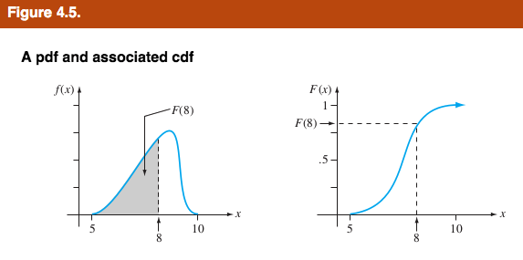
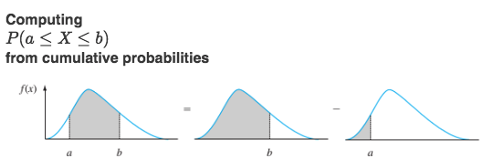

# Definitions

> Let $X$ be a continuous random variable. Then a **probability distribution** or **probability density function** (pdf) of $X$ is a funciton $f(x)$ such that any two numbers a and b with $a\leq b$, $$P(\alpha \leq X \leq b) = \int_{a}^{b} f(x) dx$$ That is, the probability that $X$ takes on a value in the interval $[a,b]$ is the area above this interval and under the graph of the density funciton, as illustrated in **Figure 4.2** . The graph of $f(x)$ is often referred to as the *density curve*.  
<center>

</center>

> A continuous random variable $X$ is said to have a **uniform distribution** on the interval $[A,B]$ if the pdf of $X$ is <center>
\[ 
f(x;A,B) = \begin{cases}
      \frac{1}{B-A} & A \leq x \leq B \\
      0 & \text{otherwise} 
   \end{cases}
\]

</center>

* continuous at all possible values of interval

* cdf of x is : 
\[ 
F(X) = \begin{cases}
      0 & if x\leq A \\
      \frac{x-A}{B-A} & if A\leq x\leq B\\ 
      1 & x \geq B
   \end{cases}
\]

* cdf is always a non-decreasing function 

> The **cumulative distribution function** $F(x)$ for a continuous random variable $X$ is defined for ever number $x$ by $$F(x) = P(X \leq x ) \ \int_{- \infty}^{x} f(y)dy $$ For each $x, F(x)$ is the area under the density curve to the left of x. This is illustrated in **Figure 4.5**, where $F(x)$ increases smoothly as x increases. 
<center>

</center>

> Let $p$ be a number between 0 and 1. The $(100p)$th **percentile** of the distribution of a continuous rv X, denoted by $\eta (p)$, is defined by $$p=F(\eta (p))=\int_{-\infty}^{\eta (p)}f(y)dy$$
<center>

</center>

> The **median** of a continous distribution, denoterd by $\widetilde \mu$ , is the 50th percentile, so $\widetilde \mu$ satisifies $0.5=F(\widetilde \mu)$ . That is, half the area under the density curve is to the left of $\widetilde \mu$ and half is to the right of $\widetilde \mu$ . 

<center>
> 
</center>

> The **expected** or **mean value** of a continuous rv X with pdf $f(x)$ is $$\mu x=E(x)=\int_{-\infty}^{\infty}x\cdot f(x)dx$$

> The **variance** of a continuous rv X with pdf $f(x)$ and mean value $\mu$ is $$\sigma_{X}^{2}=V(X)=\int_{-\infty}^{\infty}(x-\mu)^2\cdot f(x)dx=E[(X-\mu)^2]$$

> The **standard deviation** (SD) of X is $\sigma_{X}=\sqrt{V(X)}$

# Theorems

> **Proposition** : Let $X$ be a continuous random variable with pdf $f(x)$ and cdf $F(x)$. Then for any number $a$, $$P(X>a)=1-F(a)$$ and for any two numbers a and b with $a<b$, $$P(a \leq X \leq b) = F(b)-F(a)$$
<center>

</center>

> **Proposition - Obtaining f(x) from F(x) :** IF X is a continuos rv with pdf $f(x)$ and cdf $F(x)$, then at every x at which the derivative $F'(x)$ exists, $F'(x)=f(x)$ .

* $f(x)=\frac{d}{dx}F(x)$ : find pdf by differentiating cdf

* $F(x)=\int_{-\infty}^{x}f(t)dt$ : find cdf by integrating pdf

* x is fixed point, do not use x within the function that being integrated (use dummy variable t)

> **Proposition :** If X is a continous rv with pdf $f(x)$ and $h(X)$ is any function of X, then $$E[h(X)]=\mu_{h}(x)=\int_{-\infty}^{\infty}h(x)\cdot f(x)dx$$

> **Proposition :** $$V(X)=E(X^2)-[E(X)]^2$$

# Examples

### Exercise 1 (page 146)
**The current in a certain circuit as measured by an ammeter is a continuous random variable X with the following density function:** 
\[ 
f(x) = \begin{cases}
      0.075x +0.2 & 3\leq x\leq 5 \\
      0 &\text{otherwise}\
   \end{cases}
\]

a. **Graph the pdf and verify that the total area under the density curve is indeed 1.** 
```{r, echo=F}
curve(0.075*x+0.2,3,5, ylim = c(0,0.75), ylab = "y")
```
\begin{equation} \label{eq1}
\begin{split}
\int_{-\infty}^{\infty}f(x)dx & =\int_{-\infty}^{3}0+\int_{3}^{5}(0.075x+0.2)dx+\int_{5}^{\infty}0\\
& =\frac{0.075x^2}{2}|_{3}^{3}+0.2(5-3)\\
& =\frac{(0.75)5^2}{2}-\frac{(0.75)3^2}{2}+0.4\\
& =1
\end{split}
\end{equation}

b. **Calculate $P(X\leq 4)$. How does this probability compare to P($X<4$)?**

\begin{equation} \label{eq2}
\begin{split}
P(X\leq 4) & =\int_{-\infty}^{4}f(x)dx\\
& =0+\int_{3}^{4}(0.70x+0.2)dx\\
& =\frac{0.075x^2}{2}+0.2|_{3}^{4}\\
& =0.4625
\end{split}
\end{equation}

$P(X\leq 4)=P(X<4)$

c. **Calculate $P(3.5\leq X\leq 4.5)$ and also P($4.5<X$).**

\begin{equation} \label{eq3}
\begin{split}
P(3.5\leq X\leq 4.5) & =\int_{3.5}^{4.5}f(x)dx\\
& =0.075\frac{x^2}{2}|_{3.5}^{4.5}+0.2\\
& =0.075(\frac{4.5^2}{2}-\frac{3.5^2}{2})+0.2\\
& =0.075(10.125-6.125)+0.2\\
& =0.5
\end{split}
\end{equation}

$P(X<4.5)=0.278125$
 
### Exercise 13 (page 155)
**Example 4.5** introducted the concept of time headway in traffic flow and proposed a particular distribution for X = the headway between two randomly selected consecutice cars (sec). Suppose that in a different traffic enviroment, the distribution of time headway has the form
\[ 
f(x) = \begin{cases}
      \frac{k}{x^4} & x>1\\
      0 & x\leq 1
   \end{cases}
\]
 a. **Determine the value of $k$ for which $f(x)$ is a legitimate pdf.**
 
What is the value of k>0?
\begin{equation} \label{eq4}
\begin{split}
1 =\int_{-\infty}^{\infty}f(x)dx & =\int_{-\infty}^{1}f(x)dx+\int_{1}^{\infty}f(x)dx\\
& = 0+k\int_{1}^{\infty}\frac{1}{x^4}dx\\
& = k(\frac{x^{-3}}{-3})|_{1}^{\infty}\\
& = \frac{k}{3}
\end{split}
\end{equation}
$\Rightarrow k = 3$
 
 b. **Obtain the cumulative distribuion function.** 

 $F(x)=0$ if $x\leq 1$ . So if $x>1$
 \begin{equation} \label{eq5}
\begin{split}
F(x) & =\int_{-\infty}^{x}f(t)dt \pm \int_{-\infty}^{1}f(t)dt + \int_{1}^{x}f(t)dt\\
& = 0 + \int_{1}^{x}\frac{3}{t^4}dt\\
& = 3(\frac{t^{-3}}{-3}|_{1}^{x})\\
& = 1 - \frac{1}{x^3}
\end{split}
\end{equation}
Therefore,
\[ 
F(x) = \begin{cases}
      0 & x\leq 1\\
      1 - \frac{1}{x^3} & x>1
   \end{cases}
\]
 
 c. **Use the cdf from (b) to determine the probability that headway exceeds 2 sec and also the probability that headway is between 2 and 3 sec.** 
 
\begin{equation} \label{eq6}
\begin{split}
P[X>2] & =1-P[x\leq 2]\\
& = 1-F(2)\\
& = 1-(1-\frac{1}{2^3})\\
& = \frac{1}{8}
\end{split}
\end{equation}
\begin{equation} \label{eq7}
\begin{split}
P[2\leq x\leq 3] & =F(3)-F(2)\\
& = 1-\frac{1}{3^3}-(1-\frac{1}{2^3})\\
& = \frac{1}{8}-\frac{1}{27}\\
& = \frac{19}{216}
\end{split}
\end{equation}
 
 d. **Obtain the mean value of headway and the standard deviation of headway** 
 
 1.5, 0.866
 
 e. **What is the probability that headway is within 1 standard deviation of the mean value?** 
 
 = 0.924